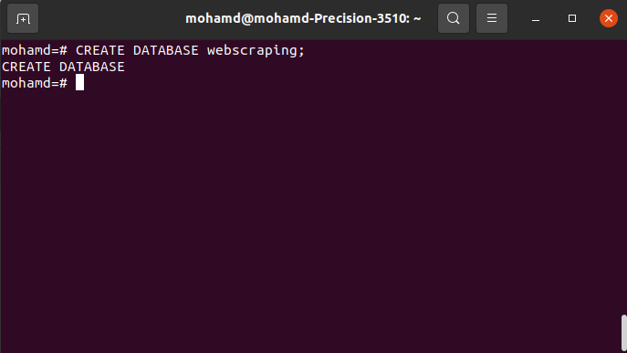
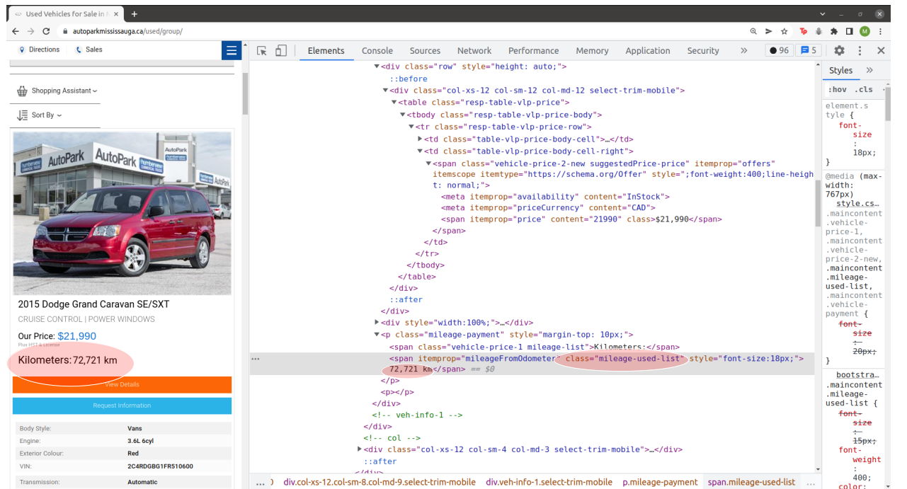
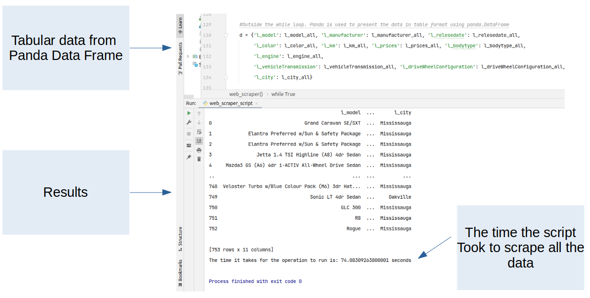
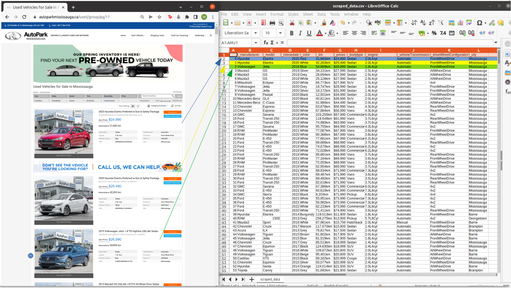
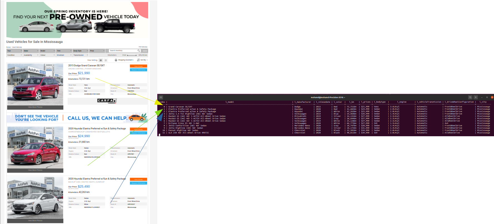
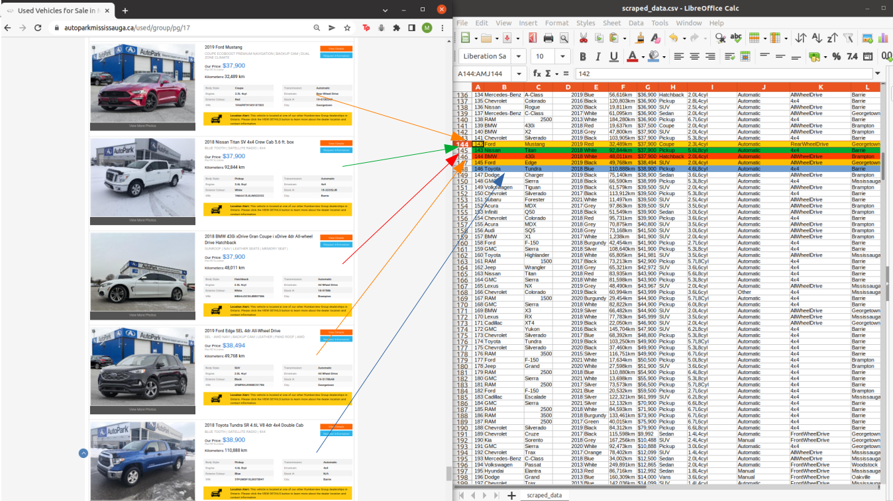
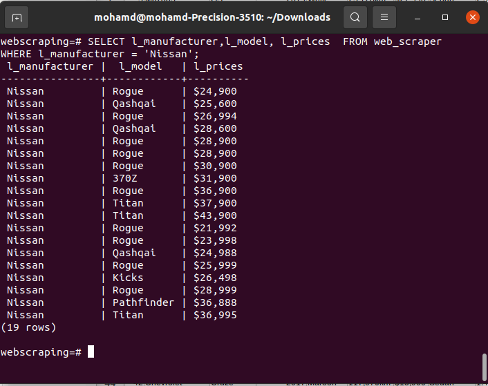

<h1>Welcome to my web scraping project &#128075; </h1>

<h2> About The Project </h2>

 This project is a web scraper that scrapes the data of used vehicles from 
<a href="https://www.autoparkmississauga.ca/">Auto Park's Web page</a>. As of <b>March 26, 2022</b> the data is scrapped smoothly.
Any modifications to the Auto Park's web page could potentially impact the web scraper

<h2> Technologies</h2>
<ul>
<li> The following libraries are utilized in Python: </li>
<ul> 
<li>
Beautiful Soup library.
</li>
<li>
Requests Library.</li>
<li>
The lxml library.</li>
<li>
The pandas library.</li>
<li>
The sqlalchemy library.</li>
<li>
The time library.</li>

</ul>

<li>
The data is transferred from Python into PostgreSQL.</li>

<li>
Git is utilized as the VCS. 
</li>

<li>
HTML/CSS is utilized by allowing me to be able to properly read what I am scraping.
</li>

<li>
The whole application is written in Pycharm IDE and the system is operated by Linux.
</li>
</ul>

<h2> Project's Breakdown </h2>
<ul>
<li>
The project is broken down into six steps and all the steps are presented below along with images if needed</li>
<li>
The web_scraper.py file is contains comments explaining the reasoning behind writing specific code.
</li>
</ul>

<h2> Step 1 </h2>
<ul>
<li>
The frist step was importing all the important libraries.
</li>
</ul>

<h2> Step 2 </h2>
<ul>
<li>
A data base is created in PostgreSQL. which the data scraped will be saved too. 

</li>
</ul>

<h2> Step 3 </h2>
<ul>
<li>
Using the requests library and the bs4 library with the lxml parser 
a connection with the web page is created.

</li>
</ul>

<h2> Step 4 </h2>
<ul>
<li>
The main parameters are filtered out. The following parameters were chosen in the script: </li> <ul>
<li>
Model, Year, Color, KM, Price, Body Type, 
Engine Type, Transmission type, Wheel Configuration, & City.
 </li>
</ul>
<li>Each parameter must be scraped then added to a list within a while loop. The while loop would loop through all the pages in the web page. 
When done a complete list of every parameter is captured.</li>
<li>The image below displays the selection of the km parameter from Auto Park's Web page. The following must be noted: </li>
<ul>
<li>The parameter is Kilometers and in the image below it is 72,721.</li>
<li>The parameter is placed between a "spun" tag and has a "class" called mileage-used-list.</li>
<li>The code to scrape the that information is :- results_prices = soup.find_all('span', class_='vehicle-price-2-new suggestedPrice-price').</li>

</ul>

</ul>

<h2> Step 5 </h2>
<ul>
<li>
Using the Panda library the data is presented in a tabular format. A screenshot of the DataFrame & The results is presented below:</li> 
<li><b>The total number of rows is 753 which indicates that the scraper looped 
through every page in the web site and scraped the data of 753 vehicles at the time of this recording</b></li>

</ul>

<h2> Step 5 </h2>
<ul>
<li>
Using the Panda library the data is transferred into .csv file. A screenshot of the image is below: </li> 

</ul>

<h2> Step 6 </h2>
<ul>
<li>
Using the Panda library & sqlalchemy library the data was inputted into a table within the DATA BASE created in step 2.</li> 
<li> The name of the table in the python script is set to be "web_scraper".
</li> 
<li>
A screenshot of the results is below: 
</li>

</ul>

<h2> Results Examples </h2>
<ul>
<li>
A screenshot of additional correlations between the web page and .csv file:</li>

</ul>
<ul>
<li>
A screenshot of a query in PostgreSQL that displays the data of manufacturer, model, and prices columns where the manufacture is “Nissan”: </li>

</ul>